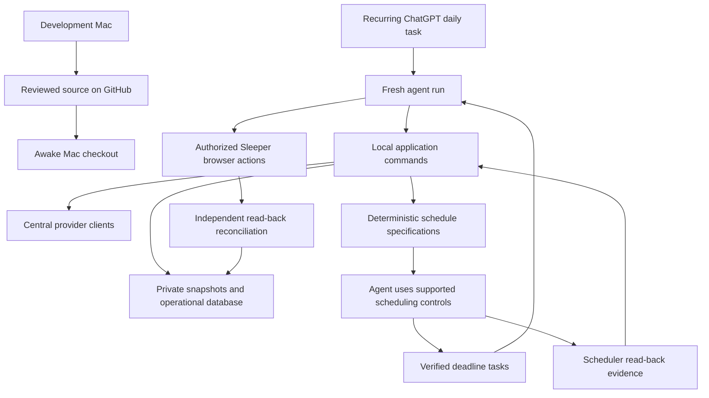

# Mac-based season automation design

September 10, 2026. Proposed design. Implementation and live capabilities are not yet verified. This document supersedes the cloud-first recommendation in SEASON_AGENT_ARCHITECTURE.md. Delivery steps and acceptance gates are in [MAC_AUTOMATION_MILESTONES.md](MAC_AUTOMATION_MILESTONES.md).

**1. Architecture decision**

Build the complete system on this Mac. Test all workflows here, including scheduled browser access and Pushover alerts. Complete local acceptance before transfer. Then use GitHub to move the tested system to the second Mac. Repeat machine-specific checks there. Only one Mac operates at a time.

ChatGPT scheduled tasks start bounded agent conversations. Python scripts own deadlines, desired task specifications, validation and durable records. The active ChatGPT session supplies inference and authorized native browser interaction with Sleeper.

There is no custom agent launcher, cloud worker, public scheduling API or unattended browser runtime assumed by this design. GitHub distributes code. It is not the scheduler or runtime database. The phone is an optional review/activation interface, subject to testing Remote on the owner's account.



Official documentation describes three functions:

- Standalone scheduled tasks create a new chat per run.
- Local tasks require the computer on and the app running.
- Chats and skills can create or update tasks.

The documentation does not establish that this account's scheduled runs can enumerate tasks, schedule one-off runs, cancel them, or use our browser tools. Those are milestone-zero probes. Current session tool discovery did not expose a scheduling tool. [Official scheduling documentation](https://learn.chatgpt.com/docs/automations).

**2. Capability gates and fallback modes**

Persist observed capability evidence by machine, account/workspace, app version, execution mode and observation time. Each feature is `verified`, `unsupported`, `unavailable` or `untested`. A manual interactive success does not verify a scheduled run. Repeat affected probes after significant app, permission or account changes.

| Capability | Evidence required | If absent |
|---|---|---|
| Fresh scheduled local run | Scheduled chat writes a harmless receipt in the intended checkout | Manual activation only |
| Local command/network access | Saved probe succeeds unattended through central clients | Scheduled offline reporting or manual collection |
| Browser access | Scheduled session inspects native Sleeper state without writes | Automated analysis, manually activated application |
| Task inventory | Complete inventory, IDs, schedule and pagination/completeness evidence | Cannot claim automatic deduplication or reconciliation |
| Create/update/disable or cancel | Harmless test tasks changed and read back | Fixed owner-configured schedules with explicit manual maintenance |
| Exact one-off timing | Test run occurs at specified time and does not recur | Use only verified supported recurrence semantics. No improvised one-off encoding |
| Notification delivery | Owner observes test delivery on phone | Scheduled results require manual inspection |

If full task management works, use a daily planner plus generated deadline tasks. If it does not, retain deterministic desired schedules and present exact setup instructions to the owner. A fixed recurring dispatcher is an optional fallback only if its cadence, browser access and usage costs are tested. It reads due work from disk but cannot run more precisely than its wake-up frequency. Do not silently substitute a local OS timer as an agent launcher.

**3. Deterministic ownership**

| Scripts decide | Agent decides or performs |
|---|---|
| UTC timestamps, relevant games, policy offsets, legal scheduling windows | Interpret football evidence and explain a choice |
| Stable check IDs, deduplication, task payloads and expected hashes | Execute exact scheduling operations through supported controls |
| Schema validation, source age, schedule diff and read-back comparison | Inspect native browser state and perform authorized UI steps |
| Legal lineup assignments, authority gates and execution receipts | Resolve permitted review items with cited evidence |
| Missing coverage, missed runs, retries, operational status | Notify/ask owner when a supported resolution is unavailable |

The agent cannot change schedule policy, invent task IDs, mark its prose as scheduler confirmation, or clear a validator failure by assertion. Strategic overrides preserve the numerical recommendation and their rationale.

**4. Proposed code and data boundaries**

The names below describe proposed additions. These commands do not exist yet. Keep existing provider access and weekly services. Avoid rewriting them just to support scheduling.

| Module | Responsibility |
|---|---|
| `automation_store.py` | SQLite transactions, schema migrations, events and run claims |
| `automation_deadlines.py` | Normalize verified fixtures/league deadlines into typed observations |
| `automation_plan.py` | Pure deadline/policy-to-check planning and task rendering |
| `automation_reconcile.py` | Compare desired specs with observed scheduler inventory |
| `automation_run.py` | Bounded run lifecycle, context packet, state/authority checks |
| `automation_health.py` | Coverage, missed runs, unresolved actions and notification receipts |
| `automation.py` | Reusable CLI over these services |
| `prompts/automation_daily.md`, `prompts/automation_check.md` | Versioned instructions rendered into exact task payloads |
| `config/automation_policy.example.json` | Non-personal policy example and documented defaults |
| `schemas/automation_*.schema.json` | Versioned contracts for plans, inventory and receipts |

Runtime state stays under tracked `data/automation/`: `state.sqlite3`, immutable `plans/`, `scheduler_observations/`, `runs/`, `capabilities/` and `health.json`. Existing weekly evidence remains under `data/weekly/`. Export JSON with `storage.save_atomic`. Serialize ledger transitions in SQLite. Preserve original provider cache directories and their policies. SQLite and filesystem locks protect only processes on the same machine.

Use a simple local configuration for the checkout path and account setup. League settings, policy and runtime state travel with the repository. Assume only one Mac runs at a time. No host binding or development/runtime role system is needed. Avoid hard-coded `/Users/alex/...` paths in published commands. Resolve paths from the installed project root and use its tested interpreter. Unknown schema versions fail explicitly.

**5. Structured contracts**

| Object | Required fields and invariants |
|---|---|
| Deadline observation | Stable event ID, kind, season/week, relevant player IDs, UTC time, source references, observed/publication times, freshness and uncertainty |
| Policy | Version, local time zone, daily planner time, per-kind offsets, planning horizon, lateness tolerance, execution buffer, task cap and allowed operations |
| Desired check | Stable check ID, scope, operation enum, event references, due/latest-start/expiry times, priority, policy/input hashes, task-template version |
| Scheduler observation | Capture ID/time, source/control used, completeness, pagination status, scheduler task IDs, enabled state, exact timing/time zone, prompt and target project |
| Operation | Operation ID, create/update/disable/no-op, target task ID when known, expected old hash, exact desired payload, expiry and dependencies |
| Run receipt | Run ID, check ID/revision, host/release IDs, claim time, outcome, artifacts, actual provider attempts/cache hits, next coverage and unresolved actions |

The planner derives a stable check identity from league, season, week, event ID, check kind and policy offset. Kickoff time is a mutable field, so a postponement updates the existing logical check. A revision hash detects changed payloads. Merging nearby checks must preserve every constituent obligation and must never delay an earlier deadline. Start without merging until tested.

Example schema shape (synthetic IDs and times, not this week's schedule):

```json
{
  "schema_version": 1,
  "check_id": "example-league:2026:1:game-123:availability:30m",
  "revision": "sha256-of-canonical-spec",
  "operation": "validate_lineup",
  "season": 2026,
  "week": 1,
  "run_at": "2026-09-13T16:30:00Z",
  "latest_start_at": "2026-09-13T16:40:00Z",
  "expires_at": "2026-09-13T16:45:00Z",
  "deadline_ids": ["game-123"],
  "policy_version": "1"
}
```

Configured buffers must be chosen from measured runtime and recovery latency. These example times are not operational recommendations. Task text contains an allowlisted command and opaque check ID, not arbitrary provider text, credentials or the whole chat history. Canonical serialization, enum validation and length limits apply before rendering or importing scheduling payloads.

**6. Planning algorithm**

1. Validate current league/NFL week, ownership, fixture coverage and source freshness. Collect through `sleeper.get_sleeper`, `fantasypros.get_fantasypros` and `nflverse.get_nflverse` only where needed. Scheduling-only work should not fetch projections unnecessarily.
2. Enumerate relevant deadlines for starters, bench alternatives, waivers and unresolved reviews. Include earlier backup locks, overnight events and next-week games when within the horizon. Use verified league rules rather than assumed weekdays.
3. Apply policy offsets mechanically. Start with daily planning and game checks 90/30 minutes before relevant kickoff. Waiver planning/reconciliation offsets remain configurable and must use actual rules. UTC arithmetic plus America/New_York display handles daylight saving.
4. Cover at least until the next daily run plus a configurable recovery overlap. A proposed starting horizon is 48 hours. This reduces exposure to one missed daily planner but does not guarantee coverage after an outage.
5. For past-due work, run only if still useful and within latest-start/expiry bounds. Otherwise record missed coverage. A late game update cannot unlock a player by inference.
6. Produce a canonical desired plan with stable IDs. Identical inputs, policy and explicit clock produce identical output. Missing evidence produces a blocker and a bounded retry obligation, not invented deadlines or wholesale cancellation of previously verified future checks.
7. Enforce task limits and reserve room for the daily anchor/recovery checks. If capacity is insufficient, report uncovered obligations. Do not silently discard the earliest deadline or claim coverage.

**7. Scheduling reconciliation protocol**

Install the recurring daily anchor once. Protect it from ordinary plan cleanup. Identify it by installation metadata, not title alone. The daily run maintains additional checks. All mutations use a verified supported ChatGPT control. Scripts never call undocumented scheduling endpoints or edit internal app databases.

Acquire the local scheduling lock, read a complete fresh inventory, import it with provenance, compute the diff, then execute one operation at a time. Record the returned scheduler ID and re-list/read back its enabled state, time, project and prompt hash. Finally compare the full observed schedule with the desired plan and publish coverage gaps. Only tasks carrying this installation's ownership marker may be changed.

After a timeout during creation, mark the operation `OUTCOME_UNKNOWN`. Reinspect for its stable marker before retrying. A missing local receipt is not proof creation failed. Duplicate matches are an explicit reconciliation condition. Do not create further copies until the observed state is understood. If task-list access fails, do not interpret that as an empty schedule.

Prefer in-place updates. If replacing a task is necessary, verify the replacement before disabling the old one when capacity permits. Local check claims suppress duplicate work. If capacity prevents safe replacement, report the uncovered interval and require a supported recovery path. Scheduler inventory exported by an agent/UI has weaker provenance than a structured tool result. Label it and test field extraction. Agent declarations alone cannot establish platform state.

Task prompt entry is conceptually `python3 -m fantasy_agent automation begin --check-id CHECK_ID --revision HASH`. The actual renderer supplies the tested interpreter and project configuration. It never grants additional authority. A removed, superseded, expired task exits without provider collection or browser action. Version drift causes revalidation, not execution of the old payload.

**8. Run lifecycle and browser execution**

A fresh session loads a bounded context packet: operational instructions, runtime authority, current check, latest relevant proposal/evidence, unresolved execution state and source pointers. Fetch older history only when needed. Each check has separate scheduled/due/running/completed/failed/missed states. Scheduling success is not work completion.

`begin` atomically claims the check with a lease and run token. Every later transition verifies that token. An expired worker cannot resume mutating work. Only one Sleeper mutation sequence per team is eligible at a time. A replacement run with an unknown browser outcome starts with inspection. Cooperative checks cannot physically prevent a rogue stale UI click, so overlapping browser sessions remain prohibited operationally.

Run the existing weekly pipeline, record a proposal with rationale, independently validate the exact proposal and verify native locks. Require PASS before unattended execution. Also require standing authority and fresh relevant state. REVIEW/FAIL/UNAVAILABLE remain blockers. Implement structured authoritative availability evidence and review resolution before claiming automated late-injury management. The current keyword/news checks are not official inactive confirmation.

Apply authorized changes sequentially through native Sleeper controls and reconcile the full lineup through central reads. Record `APPLIED_UNVERIFIED` or `OUTCOME_UNKNOWN` when evidence disagrees. Do not retry blindly. The existing Purdy browser/API disagreement is the first reconciliation case to resolve. Waiver submission and successful acquisition are distinct future transaction states.

The agent ends with saved results, actual attempts/cache hits, outstanding intervention and verified next checks. A crash leaves an incomplete receipt that a later run can detect. No endless conversation or self-renewing reasoning loop is required.

**9. Failures, authority and health**

The owner selected Pushover for phone alerts. Implement a reusable central
Pushover client and notification command, independent of browser access. Keep
the application token and user key in `.env`, never in tracked data or logs.
Alert on browser/login failures, unverified changes and deadlines requiring owner
intervention. Include the problem, verified action status, relevant deadline and
next step. Deduplicate unresolved incidents and bound retries. Record send
results separately from owner acknowledgment. Verify phone delivery during setup.
This document records the selection. The integration has no implementation or configuration yet.

Modes are `disabled`, `observe`, `propose` and `authorized_apply`. New scheduled automation starts disabled until its setup is verified. A stored owner policy defines allowed actions, protected players, transaction limits and expiry. A schedule cannot expand that policy. Trades and communications to other managers require explicit authority. Normal questions do not alter strategy.

The health report distinguishes schedule coverage, actual completed checks, current input freshness, browser readiness, unresolved changes and notification status. Track missed deadlines, duplicate deliveries, unknown outcomes, elapsed runtime and owner interventions. A task appearing in Scheduled is not proof it ran.

If the Mac/app is off, the daily task cannot repair itself. A separately configured external heartbeat monitor is optional and should detect missing completed-run receipts. Local-only monitoring cannot alert while the entire Mac is unavailable. Without it, disclose reliance on the owner's daily check. Test notification delivery and acknowledgment separately. Login expiry, reboot, permission prompts and UI changes can require activation from the owner.

**10. Git handoff between Macs**

The user authorized tracking all project data in Git on September 10. Commit source, tests, documentation and the complete `data/` directory, including snapshots, weekly history, locks and provider cache/quota ledgers. Keep `.env`, credentials and browser login material excluded. Retain the existing repository history. No source-only export or separate private data-transfer system is needed.

Assume only one Mac operates at a time. Finish the current run, commit and push its code/data, then pull on the other Mac before starting there. Do not run collection while taking the Git snapshot. Preserve original evidence timestamps and refresh mutable state through the central clients before decisions. If returning to this Mac, use the same commit/push/pull sequence in reverse.

On the awake Mac, clone the repository, set up Python and `.env`, sign in to ChatGPT and Sleeper, and verify scheduled-task/browser access. ChatGPT task definitions, app permissions and logins require local setup. Copying repository data does not install them. Use the local checkout for scheduled tasks. Do not pull during an active run. GitHub is the handoff route, not an agent launcher.
