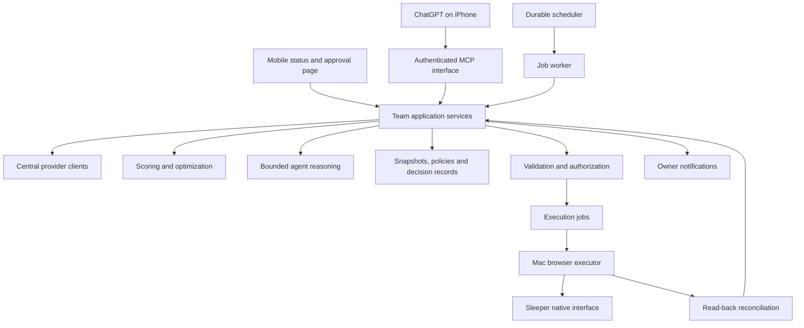

# Season-long team agent architecture

September 10 update: the user authorized committing all `data/` to Git and assumes only one Mac runs at a time. Use Git for code/data handoff. Keep `.env` and credentials excluded. This supersedes older local-only data and separate-transfer guidance.

September 10 update: the current implementation direction is the [Mac-based automation design](MAC_AUTOMATION_DESIGN.md) and its [milestone plan](MAC_AUTOMATION_MILESTONES.md). Those documents supersede this document's cloud-first deployment and custom-executor recommendations. The content below is retained as an earlier architectural option.

Proposed September 9, 2026. Planning only. No deployment, scheduling, data upload, or team action is authorized by this document. Existing operational permissions remain in force.

Build a persistent service that watches the league, develops plans, checks their legality, executes permitted actions, and verifies the results. ChatGPT on the phone and Mac should give the owner access to that service. The service owns deadlines and durable memory so that closing a chat does not abandon the team.

The practical target is autonomous monitoring and decision preparation, followed by gradually authorized execution. Sleeper execution is the largest dependency: this project's supported public API path is read-only, and supervised browser success does not establish unattended reliability. Initially, expect the owner to activate a session or make the final changes when the executor cannot proceed.

**1. Starting point**

The completed draft needs no further operation. The existing system provides central provider clients, immutable weekly snapshots, deterministic lineup optimization, separate proposal validation, and versioned proposal rationale. Reuse these services and their CLI entry points. See [weekly pipeline](WEEKLY_LINEUP.md), [validation](LINEUP_VALIDATION.md), and [MCP design](MCP_DESIGN.md).

The latest [handoff](PROGRESS.md) records Purdy starting after a browser reload, but roster/matchup API disagreement remained unresolved. Older statements that no lineup was applied are historical. Treat this as an unresolved execution record, not an instruction to repeat the swap. No scheduler currently exists. Scoring is partial, official inactive evidence is not integrated, and the validator requires review near kickoff. These are concrete limits on autonomy today.

**2. Where each part runs**

| Component | Responsibility | Design choice |
|---|---|---|
| Cloud service | Collection, calculations, decisions, jobs, deadlines and audit history | One deployable Python application initially |
| Agent worker | Interpret evidence, compare computed alternatives, explain decisions | Bounded model calls through a new central OpenAI client |
| ChatGPT on iOS | Ask questions, review changes, approve exceptions, pause management | Authenticated MCP when verified on this account. Mobile web fallback |
| ChatGPT on Mac | Development, supervised execution and recovery | Existing project and authorized computer-use workflow |
| Mac executor | Apply eligible jobs through native Sleeper controls | Separate authenticated worker. Capability must be implemented and tested |
| Notification service | Deliver urgent exceptions and routine summaries | Durable delivery queue and a tested owner-selected destination |

For the initial cloud deployment, use one small Linux VM, a persistent encrypted volume, supervised application/worker processes, HTTPS, and private backups. Keep provider retrieval on one host so existing SQLite ledgers and filesystem locks retain their meaning. Use transactional SQLite for the initial job and decision stores too. One team's workload does not justify a distributed system yet. A separate external heartbeat monitor should detect loss of the host.

If availability or workload later justifies multiple workers, move job leases and provider budget coordination to a shared transactional store before adding replicas. Copying cache directories to multiple machines would not coordinate quotas. During migration, stop the old collector, preserve its attempt/cooldown history, then start the new collector. The Mac requests fresh reads from application services rather than running a second independent collection system.

Keep `.env` and existing `data/` local under current instructions. A future cloud cutover needs an explicitly approved private-data scope, credentials provisioning, and provider-use review. Deploy source from a reviewed clean package. The existing Git history is not safe to publish automatically. No cloud price or subscription allowance is assumed. Select a host and verify costs at implementation time.

**3. What ChatGPT can contribute now**

Desktop scheduled tasks can run against local projects while the computer is on and the app is running. Their permissions still govern network and app access. That makes them a useful first-stage launcher for the existing scripts, after testing the exact unattended permissions. Use the real project and shared data paths. A fresh worktree without private data must not create a separate provider budget. [Official scheduled-task documentation](https://learn.chatgpt.com/docs/automations).

Remote can let the owner start, guide, and approve work on a connected computer from the ChatGPT mobile app. Availability depends on rollout and workspace settings, and the computer must stay awake and online. Test this on the actual account. Remote access is useful for the first stage but remains dependent on the Mac. [Official Remote documentation](https://learn.chatgpt.com/docs/remote).

For the cloud interface, implement the authenticated MCP service already proposed in MCP_DESIGN.md. Official guidance describes connection testing, tool schemas and authentication discovery. Account policy can affect developer-mode availability. Native iOS access to our exact private integration remains an acceptance test, not an assumed capability. [Official MCP connection guidance](https://developers.openai.com/plugins/deploy/connect-chatgpt).

Use the Responses API for the cloud agent, with typed application tools. Background mode can run an individual model response asynchronously and expose status for polling. Our scheduler must still create recurring jobs, enforce deadlines, persist results and recover failures. [Official background-mode documentation](https://developers.openai.com/api/docs/guides/background).

**4. The management loop**

Every run follows a durable sequence: collect → compute → reason → record proposal → validate → authorize → execute → reconcile → report. A run may conclude that no action is needed. Save that conclusion with the next check time.

Scripts own retrieval, scoring, legal assignments and calculations. The agent receives computed alternatives and timestamped evidence, interprets injuries and role changes, and selects or explains a proposal. It must preserve the numerical recommendation when it overrides it. External news remains evidence. It cannot alter permissions, issue tool instructions, or supply trusted player identities.

Start with one agent role and a deterministic validator. Extra model reviewers are optional later experiments, not a prerequisite. Persist model/version, prompt policy, source snapshot, rationale, uncertainties and costs. Cap steps, runtime and spend per job. Invoke reasoning when information or a decision materially changes instead of on every heartbeat.

| Season responsibility | Required behavior |
|---|---|
| Starting lineup | Optimize legal owned players, preserve locks, plan injury alternatives and FLEX flexibility |
| Waivers and free agents | Compare full roster outcomes after each add/drop, ordered claims, priority cost, bench value and future coverage |
| Injury reserve | Verify actual eligibility and roster rules. Plan both placement and return-to-roster consequences |
| Trades | Assess both complete rosters, replacement costs and remaining-season implications. Prepare exact offers for approval |
| Bye weeks and playoffs | Look ahead several weeks, verify playoff structure and transaction deadlines, avoid solving this week by creating an uncovered next week |
| Results and learning | Reconcile transactions and actual scoring. Evaluate forecasts and overrides against saved prediction-time baselines |

The local rules evidence indicates rolling waivers rather than a bidding system. Reverify before implementation. Do not build a FAAB bidding policy for a league that does not use it. Model ordered claims and common drop dependencies: winning an earlier claim can invalidate a later one. Submitting a claim and winning the player are separate states.

Initially maximize supported weekly projected points while accounting explicitly for future roster coverage and acquisition costs. Improve scoring coverage before relying on kicker/defense streaming comparisons. Championship probability is the eventual objective, but calibrated game distributions, correlations and season simulation are not implemented. Do not label heuristic utility as win probability. Keep feature/model changes versioned and evaluate them on chronological holdouts rather than tuning to a single bad week.

**5. Authority and realistic manual intervention**

Adopt a stored, revocable season policy before unattended writes. It should specify allowed action classes, protected players, acquisition limits, waiver-priority use, deadlines, and when an exception requires the owner. The agent cannot edit its own authority. Ordinary questions about a recommendation remain informational.

| Action | Initial mode | Possible mature mode |
|---|---|---|
| Read data, analyze, maintain backups and prepare proposals | Automatic once scheduled | Automatic |
| Swap unlocked owned starters | Supervised application | Automatic within standing authority after fresh validation |
| Injury contingency | Prepare automatically. Verify and apply with supervision | Automatic only for supported evidence and a still-legal validated plan |
| Waiver/free-agent add and drop | Owner approves exact players and claim order | Bounded authority for expressly permitted transactions. Protected drops escalate |
| IR movement | Supervised until eligibility and reversal consequences are covered | Automatic under an explicit rule policy |
| Trade offer, acceptance, or messages to other managers | Explicit owner authorization | Retain explicit approval unless separately delegated |
| Login/MFA, unexpected UI, unresolved evidence or platform disagreement | Owner intervention | Owner intervention remains available |

Approval must bind the exact proposal hash and transaction details. A later change or expired evidence triggers revalidation. It cannot inherit approval for a different transaction. A recurring authority policy avoids asking the same permission each week. An unanswered request does not become permission at the deadline.

The current validator's REVIEW/FAIL/UNAVAILABLE outcomes block unattended execution. Add authoritative availability evidence and a structured review-resolution mechanism before reducing those blocks. Record who resolved a finding, supporting evidence, affected players and expiry, then revalidate. Never convert an agent-written rationale into proof of availability or introduce a general “ignore review” switch.

**6. Execution and recovery**

Keep the executor replaceable: supervised Mac session first. A dedicated Mac worker second if supported. A cloud browser only after separate feasibility and authorization testing. An awake Mac or a scheduled chat alone does not establish unattended browser access. Validate the actual runner, browser permissions, authenticated session and recovery after reboot or expiry. Never implement hidden Sleeper account-write endpoints.

The Mac worker should connect outbound to the backend using a device credential and receive narrowly scoped jobs. It should not expose a general remote shell. For each job, recheck account, league, ownership, native locks and exact state. Apply changes sequentially. Inspect each visible result. Reload and reconcile the entire affected state through central reads. Computer-use guidance likewise recommends a restricted environment, bounded runs and outcome verification. [Official computer-use documentation](https://developers.openai.com/api/docs/guides/tools-computer-use).

Use an execution state machine:

`PROPOSED → VALIDATED → AUTHORIZED → EXECUTING → APPLIED_UNVERIFIED → VERIFIED`

Alternative outcomes include `NEEDS_REVIEW`, `EXPIRED`, `FAILED` and `OUTCOME_UNKNOWN`. Waiver claims additionally need `SUBMITTED`, `PENDING`, `WON`, `LOST` or `CANCELLED`. Store each transition as an append-only event.

Allow one mutating job per team, with a lease and fencing version to prevent an old worker acting after reassignment. Deduplicate jobs by action ID and payload hash, but do not claim exactly-once browser clicks. If a click may have succeeded before a disconnect, inspect current state before retrying. A partial sequence requires replanning from observed state. Do not blindly undo a drop or repeat a swap.

Handle API/UI disagreement explicitly. Preserve screenshots and both read timestamps, suspend conflicting writes, and attempt bounded read-back with deadline-aware escalation. Resolve the existing Purdy discrepancy as the first case. Any future rule for accepting native confirmation despite API lag must be separately specified and tested. Keep the evidence distinction visible.

**7. Scheduling around actual deadlines**

Build deadlines from verified league settings, NFL fixtures and player locks. Store UTC and display America/New_York with daylight saving. Do not assume Thursday is the first game, Sunday is the only game window, or a waiver clear time stays fixed across seasons.

| Trigger | Work |
|---|---|
| Daily, away from deadlines | Refresh appropriate cached inputs, review material role/injury changes, prepare upcoming lineup and roster needs |
| Before the verified waiver deadline | Rank available players, produce exact ordered claims and obtain any required approval with a buffer |
| After waiver processing | Reconcile claim outcomes, ownership and priority. Recompute lineup and remaining options |
| Before each relevant game window | Check roughly 90 and 30 minutes before kickoff, with an earlier plan already in place |
| Material injury, ownership or schedule change | Invalidate affected proposals and recompute the legal alternatives |
| After the fantasy week | Reconcile results, archive forecasts and create the next week's deadline plan |

Those intervals are initial operating choices, not claims about provider publication times. Use an execution cutoff based on measured end-to-end latency plus recovery time. Avoid starting a multi-step change when it cannot finish safely before lock. Schedule around the earlier backup deadline when a questionable player's alternative starts first. Multiple simultaneous injuries require joint recomputation.

Persist jobs before their deadlines. After restart, identify missed jobs, expire impossible actions and process only still-useful work. Back off during provider cooldowns. Refresh only affected inputs within the existing shared quotas. A recent fetch is not proof that an upstream forecast includes a late announcement.

**8. Owner experience and operational health**

The owner should usually see a brief digest: verified lineup, roster changes, next deadline and unresolved decisions. Urgent messages should state the exact action, why it matters, when a response is needed, and the fallback. For example: “Availability unresolved. The healthy backup locks earlier. Review this proposal by the listed deadline.” Links open the exact saved proposal, not a mutable latest recommendation.

Implement owner notifications separately from MCP. Select and authorize a delivery channel during setup. Verify phone delivery and an alternate failure path. Track sent, delivered where supported, and acknowledged separately. A notification badge does not prove the owner read it. Send reminders at bounded intervals, then retain the last verified legal lineup if no authorized safe action is available.

Expose health for last successful collection, feed ages, next deadline, remaining request budget, queued jobs, execution state, Mac heartbeat/session readiness and notification delivery. Monitor missed work rather than merely whether a process exists. Add pause-all-writes and resume controls. Resume revalidates work rather than replaying the queue. Manual Sleeper changes supersede saved proposals and trigger reconciliation.

Protect credentials in server-side secret storage or the Mac credential store. Authenticate MCP users, map allowed leagues server-side, and separate read/analyze/approve/execute permissions. Restrict private evidence access and retention. Back up durable state and test restoration without resurrecting old executable jobs.

**9. Delivery order and acceptance gates**

1. **Reliable local weekly operation.** Resolve the current execution disagreement. Implement weekly action records, health reporting and deadline jobs around the existing services. Test Mac scheduling and Remote on this account. Exit gate: a full relevant game window produces fresh proposals and visible exceptions without missed checks. Every actual change has an honest verification status.
2. **Cloud monitoring and phone access.** Package the shared services. Add durable jobs. Add the central model client. Deploy private storage after approval of the data scope. Then implement MCP. Add notifications. Exit gate: with the Mac off and chat closed, cloud work continues. The phone retrieves the same durable job through native MCP or the documented fallback. Mac execution is correctly shown as unavailable.
3. **Controlled lineup execution.** Integrate authoritative availability evidence, resolve review findings structurally, and implement the scoped executor and authority policy. Exit gate: supervised runs and failure exercises cover stale approval, duplicate delivery, disconnect after click, locks, manual changes and API/UI disagreement before enabling unattended swaps.
4. **Waivers and season planning.** Add roster-wide acquisition analysis, ordered claims, drop/IR rules and claim reconciliation. Exit gate: simulated claim interactions and supervised real operations match platform behavior. Expand standing authority only to proven action classes.
5. **Strategic improvement.** Add richer workload evidence, trade analysis and calibrated opponent/season modeling as justified. Exit gate: reproducible evaluation against the simpler baseline. Report uncertainty and intervention burden as well as results.

All implementation tests and fixtures belong under `tests/` and use simulated providers and temporary storage. Run `python3 -m unittest discover -v` for implementation milestones. Live account checks are separate. Include outage, quota exhaustion, changed kickoff, reboot, expired login, failed notification and backup-restore exercises. We did not run a test suite for this documentation-only plan.

Measure missed deadlines, verified versus unknown actions, stale-data blocks, owner interventions, delivery failures, runtime and cost. A reasonable initial promotion gate is two consecutive supervised game windows with no unexplained execution outcome, plus the failure exercises. This is an engineering threshold, not statistical proof of reliability or a winning edge.

The first useful deliverable is dependable monitoring and prepared actions that need minimal activation. The ideal endpoint is routine lineup and explicitly delegated roster management running independently, with the owner involved for meaningful decisions and operational exceptions. Full hands-off execution remains conditional on the supported Sleeper UI path and demonstrated reliability.
